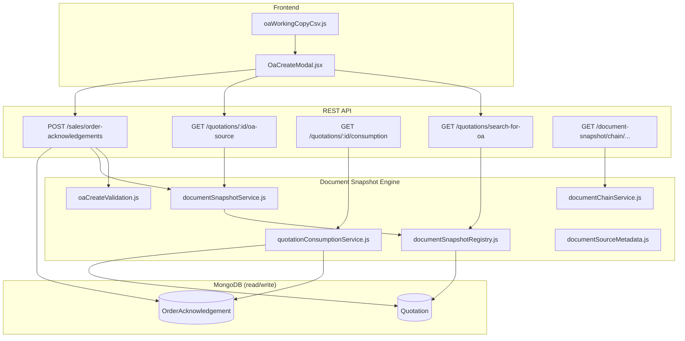
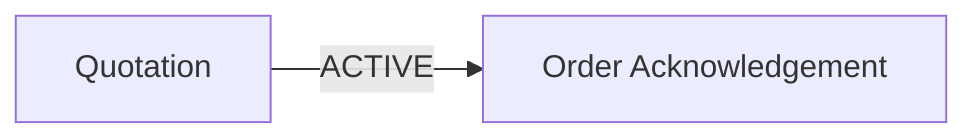
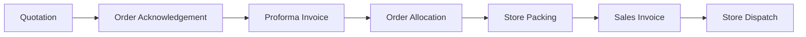

# Enterprise Document Snapshot Engine

Marivolt ERP — Sales document copy framework (v1.1+)

## Purpose

The **Enterprise Document Snapshot Engine** is a reusable backend service that creates **independent downstream documents** from upstream source documents without modifying the source.

It replaces ad-hoc, document-specific copy logic (e.g. hard-coded Quotation→OA conversion) with a **registry-based architecture** that can be extended to additional flows over time.

Primary goals:

- Support partial and adjusted orders (qty/price changes per line)
- Preserve quotation and historical document integrity
- Provide audit metadata (who copied what, when, from which source)
- Enable document chain navigation for future UI features

## Design philosophy

| Principle | Meaning |
|-----------|---------|
| **Snapshot, not sync** | Downstream documents are point-in-time copies. They do not live-update when the source changes. |
| **Never mutate source** | Loading a working copy or saving a snapshot must not call `save()` on the source document. |
| **Additive schema only** | New fields are optional with safe defaults. Old records continue to work. |
| **Server-side truth** | Totals, consumption, and validation are computed on the backend. |
| **Registry over branches** | New document flows are registered routes, not scattered `if` blocks. |

## Why snapshots are used

In real business, a customer rarely accepts a quotation exactly as quoted. They may:

- Order partial quantities
- Remove some lines
- Add lines not on the quotation
- Negotiate different prices

Modifying the original quotation to reflect an OA would corrupt the commercial record. Instead, the OA is a **new transaction** that references the quotation while storing its own ordered quantities and prices.

## Why source documents are never modified

The snapshot create path (`POST /api/sales/order-acknowledgements` with working-copy payload) **only reads** the quotation and **creates** a new OA.

It does **not**:

- Update quotation lines
- Change quotation totals
- Change quotation status
- Write to `convertedTo` on the quotation

> **Note:** The legacy endpoint `POST /api/sales/convert/quotation/:id/to-oa` still exists for backward compatibility and may update quotation status. The **New OA → From Quotation** UI uses the snapshot engine exclusively.

## Overall architecture



### Core modules

| Module | Path | Role |
|--------|------|------|
| Types | `backend/src/services/documentSnapshot/documentTypes.js` | Canonical `DOC_TYPES`, alias normalization |
| Registry | `documentSnapshotRegistry.js` | Copy route definitions + `copyDocument()` |
| Service | `documentSnapshotService.js` | Working-copy normalization, validation orchestration |
| Consumption | `quotationConsumptionService.js` | Dynamic remaining qty from linked OAs |
| Validation | `oaCreateValidation.js` | Server line validation, stale consumption detection |
| Chain | `documentChainService.js` | `documentLinks` structure for navigation |
| Metadata | `documentSourceMetadata.js` | Source snapshot fields on downstream docs |
| Facade | `oaFromQuotationService.js` | Backward-compatible re-exports |

### `copyDocument()` contract

```javascript
copyDocument({
  companyId,
  sourceType: "QUOTATION",
  destinationType: "ORDER_ACKNOWLEDGEMENT",
  sourceId,
  copiedBy,
})
```

Returns a **read-only working copy** (header + lines + metadata). The source document is loaded with `.lean()` and never saved.

## Supported document flow



| Route key | Status |
|-----------|--------|
| `QUOTATION → ORDER_ACKNOWLEDGEMENT` | **Active** — New OA from Quotation |

## Future document flow (registered, not implemented)



These routes are registered in `COPY_ROUTE_REGISTRY` with `planned: true`. Calling them returns a clear error until implemented using the same registry pattern.

## Backward compatibility strategy

1. **Schema:** All new OA header and line fields are optional with defaults (`null`, `0`, `true`, `""`).
2. **Downstream compatibility:** Persisted line `qty` and `price` remain the fields used by PI, allocation, packing, and invoice flows. Snapshot fields (`quotedQty`, `orderedQty`, etc.) are reference-only.
3. **Legacy links:** `linkedQuotationId` / `linkedQuotationNo` unchanged; new `sourceDocument*` fields complement them.
4. **Legacy convert:** `POST /sales/convert/quotation/:id/to-oa` unchanged.
5. **Old OAs:** Open, edit, print, PDF, and downstream conversion work without migration.
6. **No destructive migration:** No data rewrite, no counter changes, no deletion of historical records.

## Related documentation

- [OA Workflow](./OA-Workflow.md)
- [Snapshot & OA API](./Snapshot-OA-API.md)
- [OA Schema Additions](./OA-Schema-Additions.md)
- [Future Enhancements](./Future-Enhancements.md)

## Testing

Run unit tests (no database required):

```bash
cd backend
node scripts/documentSnapshotEngine.test.js
```
