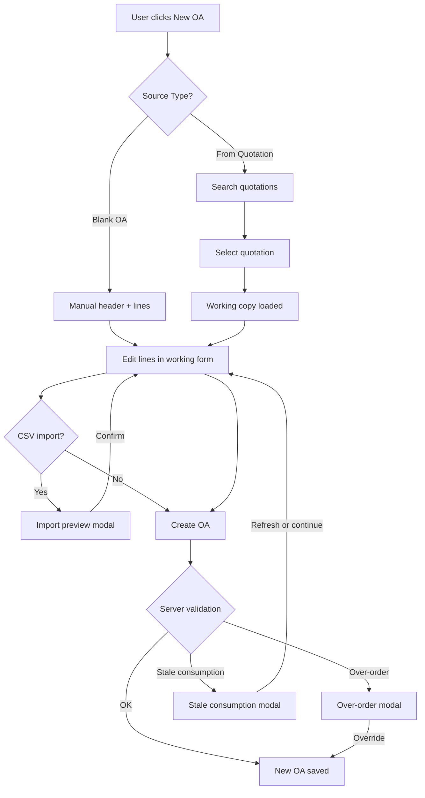

# Order Acknowledgement (OA) Workflow

Sales → Order Acknowledgement → **New OA**

This document describes the enhanced OA creation workflow introduced with the Enterprise Document Snapshot Engine.

## Overview



## Current workflow options

### Blank OA

- User selects **Source Type: Blank OA**
- Fills customer, header fields, and line grid manually
- Lines use `orderedQty` / `orderedPrice` (mapped to `qty` / `price` on save)
- No quotation link required

### OA From Quotation

- User selects **Source Type: From Quotation**
- Searches and selects an approved/sent/valid quotation
- System loads a **read-only working copy** via `GET /quotations/:id/oa-source`
- Original quotation is **not modified**

## Quotation search

Available filters:

| Filter | Query param |
|--------|-------------|
| Quotation No | `quotationNo` |
| Customer | `customerName` |
| Customer Ref | `customerRef` |
| Vertical | `vertical` |
| Brand | `brand` |
| Model | `model` |
| ESN | `esn` |
| Status | `status` (empty = any valid) |
| Date From / To | `dateFrom`, `dateTo` |
| Currency | `currency` |

Results show quotation summary columns with a **Select** action.

## Working copy

After selection, the form is populated with:

- Header snapshot (customer, currency, machine fields, costs, terms)
- Line snapshot per quotation line:
  - `quotedQty` / `quotedPrice` — frozen reference from quotation
  - `alreadyOrderedQty` / `remainingQty` — from consumption engine
  - `orderedQty` / `orderedPrice` — editable OA values (default ordered = remaining)
  - `includeInOA` — include/exclude from OA totals
- `_sourceMetadata` — audit fields persisted on save
- `consumptionBaseline` — concurrency snapshot for stale detection

Banner displayed:

> *This OA is created as a new transaction snapshot. The original quotation will not be changed.*

## Line grid behaviour

| Action | Behaviour |
|--------|-----------|
| Reduce ordered qty | Affects working copy only |
| Increase ordered qty | May trigger over-order warning |
| Change ordered price | Affects OA totals only |
| Uncheck Include | Line excluded from subtotal; not saved as active line |
| Remove (new lines only) | Deletes unsaved manual line |
| Exclude (quotation lines) | Prefer Include checkbox over hard delete |

Variance columns (From Quotation mode):

- Quoted Qty, Already Ordered, Remaining, Ordered Qty, Qty Diff
- Quoted Price, Ordered Price, Price Diff

## CSV export

**Export Lines CSV** downloads the current working lines with columns:

`includeInOA`, `article`, `partNumber`, `description`, `uom`, `quotedQty`, `orderedQty`, `quotedPrice`, `orderedPrice`, `discount`, `tax`, `remarks`, `material`, `availability`

## CSV import

**Import Lines CSV** flow:

1. File validated (max 2 MB, max 1000 rows, UTF-8)
2. Rows parsed with per-row error messages
3. **Preview modal** shows: total lines, updated, added, removed, qty/price changes
4. User must **confirm** before working lines are replaced
5. Original quotation and saved documents are never changed

## Save OA (Create)

`POST /api/sales/order-acknowledgements` with working-copy payload.

Server:

- Validates lines (qty, price, article, duplicates)
- Recomputes consumption from linked OAs
- Checks stale consumption baseline (concurrency)
- Checks over-order unless `allowOverOrder: true`
- Normalizes lines → only included lines with `orderedQty > 0`
- Recalculates totals server-side
- Persists source metadata + `linkedQuotationId`

## Partial order

Example:

| | Qty |
|---|-----|
| Quoted (quotation) | 20 |
| Already ordered (prior OAs) | 12 |
| **Remaining** | **8** |
| New OA default ordered | 8 |

User may order less (e.g. 5) or more (triggers warning).

Multiple OAs can link to the same quotation. Consumption is summed dynamically from non-cancelled OAs.

## Remaining quantity

Calculated server-side by `computeQuotationConsumption()`:

- Sums `orderedQty` (fallback `qty`) from all non-cancelled OAs with matching `linkedQuotationId`
- Matches lines by `sourceQuotationLineId`, with article+part fallback for legacy OAs
- **Does not modify quotation lines**

Refresh in UI: **Refresh remaining qty** re-fetches oa-source consumption data.

## Over-order warning

Triggered when `orderedQty > remainingQty` for a quotation line.

- Client shows inline highlight + summary banner
- Server returns `400` with `code: "OVER_ORDER"` and `violations[]`
- User must confirm **Override and Create OA** (`allowOverOrder: true`)

## Stale consumption warning (concurrency)

If another user creates an OA on the same quotation while the form is open:

- Server returns `409` with `code: "STALE_CONSUMPTION"` and `reasons[]`
- UI offers **Refresh quantities** or **Continue anyway** (`allowStaleConsumption: true`)

## Document chain

OA detail view shows:

- **Source Quotation** — clickable link to quotation detail
- Snapshot metadata when present (`copiedBy`, `copiedAt`)

API foundation for full chain navigation:

```
GET /api/document-snapshot/chain/ORDER_ACKNOWLEDGEMENT/:oaId
```

Returns `documentLinks: { self, source, origin, children, chain }`.

## Convert to OA (quotation detail)

The quotation detail **Convert to OA** button opens the **New OA From Quotation** working form (snapshot path) instead of instant legacy conversion.

Legacy instant convert API remains available for backward compatibility.

## Related documentation

- [Enterprise Document Snapshot Engine](./Enterprise-Document-Snapshot-Engine.md)
- [Snapshot & OA API](./Snapshot-OA-API.md)
- [OA Schema Additions](./OA-Schema-Additions.md)
